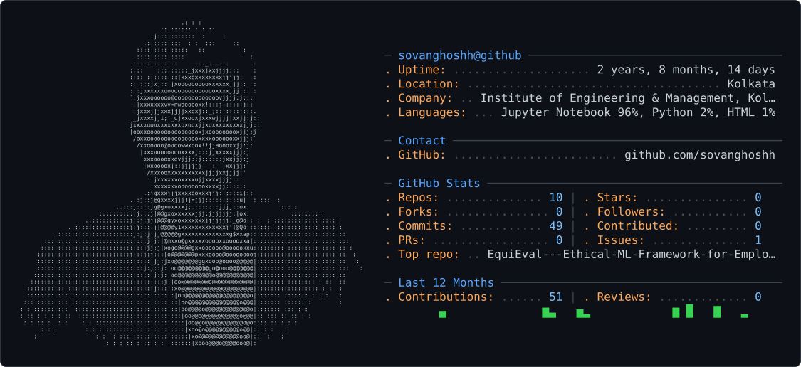

# 👋 Hey, I'm SoVaN Ghosh

<p align="center">
  
</p>

<p align="center">
  <b>Software Engineer • AI/ML Enthusiast • Full-Stack Developer • Electronics & IoT</b>
</p>

<p align="center">
  <a href="https://www.linkedin.com/in/sovan-ghosh-113a1928a/">LinkedIn</a> •
  <a href="mailto:sovanghosh.official@gmail.com">Email</a> •
  <a href="https://www.instagram.com/sovan.smile/?hl=en">Instagram</a>
</p>

---

## 🚀 About Me

I'm a software engineer interested in building **intelligent, scalable, and production-ready systems** at the intersection of software, AI, cloud, and hardware.

My current focus is on developing:

* ⚙️ **Scalable Full-Stack Applications** with Python, FastAPI, and PostgreSQL
* 🤖 **AI/ML Systems** using Deep Learning, Computer Vision, LLMs, and RAG
* 📡 **Real-Time Data & IoT Platforms** connecting industrial hardware with cloud-native systems
* ☁️ **Cloud & Distributed Systems** with AWS, streaming pipelines, and scalable architectures
* 🧠 **Intelligent Applications** that combine data engineering, machine learning, and software engineering

I enjoy turning complex engineering problems into systems that are **reliable, observable, scalable, and useful**.

---

## 🔭 Currently Working On

Building scalable applications and intelligent data platforms using:

`Python` `FastAPI` `PostgreSQL` `Kafka` `AWS` `LLM` `RAG` `IoT`

I'm particularly interested in **real-time industrial systems**, streaming architectures, predictive analytics, and AI-powered applications.

---

## 🌱 Currently Learning

Deepening my knowledge of:

`Deep Learning` `Computer Vision` `Distributed Systems` `System Design` `MLOps` `Cloud Architecture`

I'm especially interested in deploying machine learning models closer to the edge and building systems that can operate reliably at scale.

---

## 🤝 Open to Collaborate On

I'm interested in collaborating on:

**AI/ML projects** • **Open Source** • **IoT platforms** • **Edge AI** • **Real-Time Systems** • **Cloud-Native Applications**

I particularly enjoy projects that bridge the gap between **hardware and modern software infrastructure**.

---

## 💻 Tech Stack

### Languages


### Backend & APIs


### AI / Machine Learning


### Data & Databases


### Cloud & Tools


---

## 🧩 Areas of Interest

```text
Software Engineering
        │
        ├── Backend & APIs
        ├── Distributed Systems
        ├── Databases
        └── Cloud Architecture
                    │
                    ▼
              Real-Time Data
                    │
             ┌──────┴──────┐
             ▼             ▼
            IoT           Kafka
             │             │
             └──────┬──────┘
                    ▼
                AI / ML
             ┌──────┼──────┐
             ▼      ▼      ▼
           LLM/RAG CV   Predictive Analytics
                    │
                    ▼
              Intelligent Apps
```

---

## 📊 GitHub Stats

<p align="center">
  
  
</p>

<p align="center">
  
</p>

---

## 🏆 GitHub Trophies

<p align="center">
  
</p>

---

## 📈 Contribution Graph

<p align="center">
  
</p>

---

## ✍️ Developer Quote

<p align="center">
  
</p>

---

## ⚡ A Little About Me

When I'm not building software or working with electronics, you'll probably find me on the **football field**.

A good match is still one of my favorite ways to reset the brain. ⚽

---

## 🤝 Let's Connect

<p align="center">
  <a href="https://www.linkedin.com/in/sovan-ghosh-113a1928a/">
    
  </a>
  <a href="mailto:sovanghosh.official@gmail.com">
    
  </a>
  <a href="https://www.instagram.com/sovan.smile/?hl=en">
    
  </a>
</p>

<p align="center">
  <i>Building systems. Learning relentlessly. Turning ideas into reality.</i>
</p>

---

<p align="center">
  
</p>
