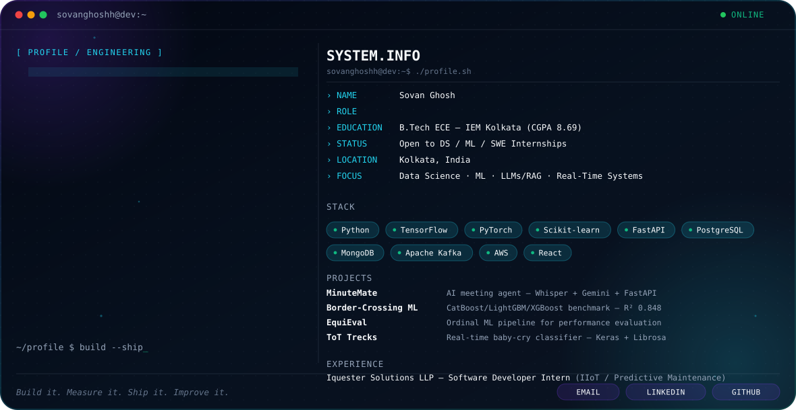

<picture>
  <source media="(prefers-color-scheme: dark)" srcset="./dark.svg">
  <source media="(prefers-color-scheme: light)" srcset="./light.svg">
  
</picture>

 

---

## About

Final-year Electronics & Communication Engineering student at **Institute of Engineering & Management (IEM), Kolkata** (CGPA 8.69), working at the intersection of **data engineering, machine learning, and backend systems**. I like the engineering distance between an idea or a model and a working system — ingestion, processing, APIs, deployment, and the interface someone actually uses.

**Core focus:** Data Engineering · Machine Learning · Backend Development · Real-Time / IoT Systems

---

## Experience

**Software Developer Intern — Iquester Solutions LLP**
Built a real-time industrial IIoT data pipeline: edge telemetry simulation → **MQTT (EMQX Cloud)** ingestion → **Python** middleware → **InfluxDB** time-series storage, feeding a live predictive-maintenance dashboard with sub-second anomaly detection.

---

## Featured Projects

| Project | Description |
|---|---|
| **MinuteMate** | Chrome Extension that captures meeting audio, transcribes it with **OpenAI Whisper** via a **FastAPI** backend, and turns it into structured notes and action items with **Google Gemini** — auto-delivered to GitHub Issues, Notion, and Slack. |
| **Statistical Analysis of U.S. Border Immigration** | Dual-border, state-level ML study across 402,318 Bureau of Transportation Statistics observations and 14 states. Benchmarked **CatBoost, LightGBM, XGBoost, and OLS** with lag/rolling features; best result **R² = 0.848** (feature-augmented CatBoost). Co-authored, published in Springer ISEM. |
| **EquiEval** | Ordinal employee-performance-classification pipeline (**Random Forest, XGBoost, CatBoost**) with VIF/RFE feature selection and **ADASYN** for class imbalance; compared six GridSearchCV-tuned scenarios using bootstrap resampling and pairwise significance testing rather than raw accuracy alone. |
| **ToT Trecks** | Real-time baby-cry audio classifier using **Keras/TensorFlow**, **PyAudio**, and **Librosa**, with a **Flask** dashboard and **SQLite** event logging for timestamped historical analysis. |

---

## Engineering Stack

**Languages**

**Data Science & ML**

**Backend, Data & Infrastructure**

**Frontend & Dashboards**

---

## Certifications

- **Python for Everybody Specialization** — University of Michigan / Coursera
- **GenAI Powered Data Analytics Job Simulation** — Tata Group / Forage
- **Data Science Job Simulation** — British Airways / Forage

---

## GitHub Activity

---

## Let's Build Something Useful

I'm interested in collaborating on machine learning, data platforms, AI automation, IoT, edge/real-time systems, and open-source software — especially projects where a technical idea needs to become a usable product.

  
<i>Build it. Measure it. Ship it. Improve it.</i>

